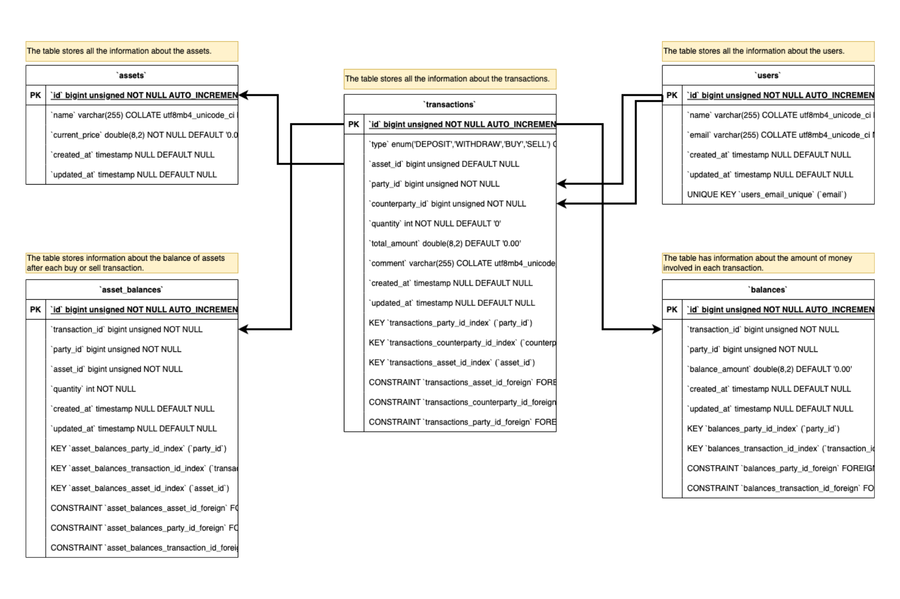

# Bookkeeping service API

Bookkeeping service APIs enable users to record and retrieve transaction information.

A transaction represents the transfer of an asset between two entities on a specific date and time, known as the transaction date. We refer to the first entity as the party and the second entity as the counterparty. An asset can encompass various valuable items such as stocks, cars, or houses.

There are four types of transactions:

- Deposit: The party deposits a specified amount in Euros to the counterparty.
- Withdrawal: The reverse direction of a deposit.
- Buy: The party purchases an asset from the counterparty by exchanging the asset's value in Euros.
- Sell: The opposite direction of a buy transaction.

A detailed document outlining the functional and non-functional requirements of the project: [Project Requirements](../Project_Requirement.md)

## Tech-Stack

* [PHP 8.1](https://www.php.net/releases/8.2/en.php)
* [Laravel 10](https://laravel.com/)
* [MySQL](https://www.mysql.com/)
* [Docker](https://www.docker.com/)
* [Dockerfile with Alpine](https://hub.docker.com/_/alpine)
* [Nginx](https://www.nginx.com)
* [Makefile](https://www.gnu.org/software/make/)
* [Swagger](https://swagger.io/)

## Run App Instructions

### Prerequisites

Ensure you have [Docker](https://www.docker.com/products/docker-desktop/), `docker-compose`, and `make` (optional) installed on the system.

### Configuration

To set the port to access the application, update the configuration in the `.env.example` file.


### Steps

1. Clone the repository to your local machine.

2. Navigate to the backend folder of the project:
   ```shell
   cd backend
   ```

3. If you have `make` installed and it works on your system, you can simplify the setup process by running:
   ```shell
   make run-app-with-setup-db
   ```
   This command will execute a predefined sequence of operations to build the Docker environment, set up the database, and run the application.

4. If you do not have `make` or prefer to run the steps manually, follow these instructions:
    - Create a `.env` file for the Laravel environment based on the `.env.example` file located in the source (`src`) folder.
    - Build the Docker images:
      ```shell
      docker-compose build
      ```
    - Start the Docker containers:
      ```shell
      docker-compose up -d
      ```
    - Enter the 'php' container in Docker:
      ```shell
      docker exec -it php /bin/sh
      ```
      Inside the 'php' container, run the following commands:
        - Install Composer dependencies:
          ```shell
          composer install
          ```
        - Set directory permissions for the `storage` folder:
          ```shell
          chmod -R 777 storage
          ```
        - Generate the application key (if not already set in the `.env` file):
          ```shell
          php artisan key:generate
          ```
        - Exit the 'php' container:
          ```shell
          exit
          ```
    - From the root folder of the project, run the database migrations:
      ```shell
      php artisan migrate
      ```
    - (Optional) Regenerate the Composer autoload files:
      ```shell
      composer dump-autoload
      ```
    - Seed the database with test data:
      ```shell
      php artisan db:seed
      ```

## API Documentation

- [Comprehensive documentation of all the API endpoints](../API_Documentation.md), request/response formats, and usage examples.
- [The collection of backend APIs](/backend/src/storage/api-docs/api-docs.json) ready to be imported into any API platform like [Postman](https://www.postman.com/) for testing.
- Swagger API documentation will be available at http://localhost:8001/api/documentation

## Database schema




